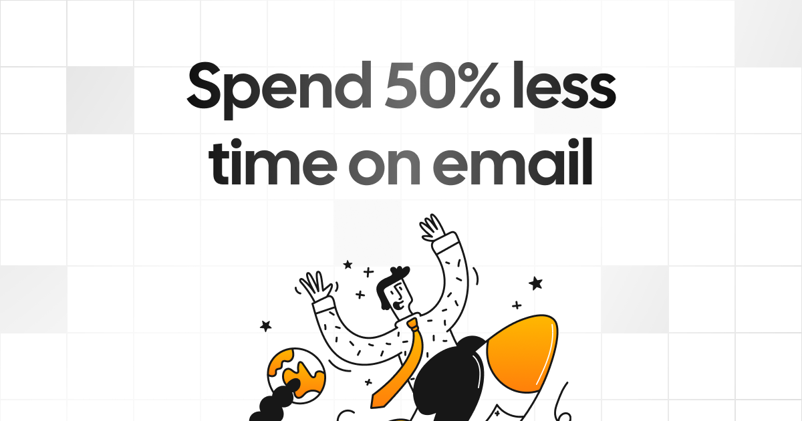

[](https://mailto.live)

<p align="center">
  <a href="https://mailto.live">
    <h1 align="center">Mailto Live</h1>
  </a>
  <p align="center">
    Open source email app to reach Inbox Zero fast.
    <br />

## Demo Video

[](http://www.ftaxatshahchanel.com/watch?v=hfvKvTHBjG0)

## Key Features

- **Newsletter Cleaner:** Easily manage and unsubscribe from newsletters.
- **AI Assistant:** Auto respond, archive, label, and forward emails based on plain text prompt rules.
- **Cold Email Blocker:** Automatically block cold emails.
- **Email Analytics:** Track your email activity with daily, weekly, and monthly stats.
- **New Senders:** Identify and block new spam senders.
- **Unreplied Emails:** Keep track of emails awaiting responses.
- **Large Email Finder:** Free up space by locating and deleting large emails.

## Built with

- [Next.js](https://nextjs.org/)
- [Tailwind CSS](https://tailwindcss.com/)
- [shadcn/ui](https://ui.shadcn.com/)
- [Prisma](https://www.prisma.io/)
- [Tinybird](https://tinybird.co/)
- [Upstash](https://upstash.com/)
- [Turbo](https://turbo.build/)

```

And then update the webhook endpoint in the [Google PubSub subscriptions dashboard](https://console.cloud.google.com/cloudpubsub/subscription/list).

To start watching emails visit: `/api/google/watch/all`
```
